# Trends, inequalities, and the impact of Rede Cegonha and COVID-19 on maternal mortality in Brazil, 2000–2023: a national interrupted time-series analysis

## Authors

[Author 1]^1^, [Author 2]^2^, [Author 3]^3^, [Author 4]^4^

^1^ [Affiliation 1]; ^2^ [Affiliation 2]; ^3^ [Affiliation 3]; ^4^ [Affiliation 4]

**Corresponding author:** [Name], [Email], [Address]

---

## Summary

**Background**
Maternal mortality is a sensitive indicator of health system performance. Brazil achieved substantial reductions in the maternal mortality ratio (MMR) between 2000 and 2015, yet progress stalled thereafter, and the COVID-19 pandemic caused an unprecedented surge in 2020–2021. We aimed to quantify temporal trends, assess the effects of the Rede Cegonha programme and the COVID-19 pandemic, and examine persistent inequalities in maternal mortality in Brazil.

**Methods**
We conducted an ecological time-series study using national death registration (SIM) and livebirth (SINASC) data from the Brazilian Ministry of Health for 2000–2023. The MMR was calculated annually for Brazil, its five macro-regions, 27 federative units, and stratified by maternal age, race/ethnicity, education, and cause of death. We used Prais-Winsten regression with first-order autocorrelation correction to estimate annual percentage change (APC) and 95% confidence intervals. An interrupted time-series (ITS) model with Newey-West standard errors assessed level and slope changes after the Rede Cegonha programme (2011) and during the COVID-19 pandemic (2020–2021). Age-standardised MMR were computed by direct standardisation.

**Findings**
Between 2000 and 2023, there were approximately 40 000 maternal deaths among over 72 million livebirths in Brazil. The national MMR declined from 73·3 per 100 000 livebirths in 2000 to a nadir of approximately 53·0 in 2012 (APC −2·94%, 95% CI −3·13 to −2·74, for 2000–2010). From 2011 to 2019, the decline stalled (APC 0·70%, 0·06 to 1·34). The MMR surged to 74·7 in 2020 and 107·5 in 2021, before returning to 56·0 in 2022. The ITS model showed a significant level change associated with the Rede Cegonha (β = −0·060, p = 0·002) and a substantial COVID-19 effect (β = 0·606, p < 0·001). Marked inequalities persisted throughout: the MMR was approximately 2·5 times higher among Indigenous women and 1·9 times higher among Black women compared with White women; the North region consistently showed the highest ratios (approximately 1·4 times the national average); and women with no formal education had an MMR nearly four times that of university-educated women. Hypertensive disorders remained the leading direct cause, but indirect causes—predominantly COVID-19-related—became the dominant category in 2020–2021. Post-pandemic, the MMR returned to pre-pandemic levels, but the underlying stagnation in progress since 2011 remains a concern.

**Interpretation**
Brazil's progress in reducing maternal mortality has plateaued since the early 2010s, and the COVID-19 pandemic caused a dramatic but transient spike. Structural inequalities by race/ethnicity, region, and education persist and require targeted policy responses. Achieving the Sustainable Development Goal target of fewer than 70 maternal deaths per 100 000 livebirths by 2030 will require renewed investment in maternal health services, with particular attention to the most vulnerable populations.

**Funding**
[Funding source]

---

## Research in context

### Evidence before this study
We searched PubMed and Google Scholar for articles published in any language from Jan 1, 2000, to Dec 31, 2025, using the terms "maternal mortality", "Brazil", "trends", "COVID-19", "Rede Cegonha", "interrupted time series", and "inequalities". Previous studies documented the decline in the Brazilian MMR during 2000–2015 and the impact of COVID-19, but most covered limited time spans, used aggregated data without stratification, or did not simultaneously assess the effects of the Rede Cegonha and the pandemic using formal interrupted time-series methods. Racial and socioeconomic inequalities in maternal mortality have been described in cross-sectional studies and state-level analyses but have not been systematically characterised over 24 years at the national level.

### Added value of this study
To our knowledge, this is the most comprehensive analysis of maternal mortality trends in Brazil, covering 24 years (2000–2023) with complete national data stratified by region, state, age, race/ethnicity, education, and cause of death. We applied Prais-Winsten regression and interrupted time-series analysis with robust standard errors to formally quantify both the Rede Cegonha programme effect and the COVID-19 disruption. Our age-standardised estimates allow for valid temporal comparisons, and the cause-specific analysis reveals important shifts in the epidemiological profile of maternal deaths.

### Implications of all the available evidence
The stagnation in maternal mortality reduction since 2011 and the persistent racial and regional inequalities highlight the need for targeted interventions beyond the current policy framework. The post-pandemic recovery in the MMR is encouraging but does not address the structural barriers that prevented further progress before 2020. Achieving SDG 3.1 by 2030 will require specific attention to Indigenous and Black women, the North and Northeast regions, and the strengthening of referral networks for obstetric emergencies.

---

## Introduction

Maternal mortality remains a critical indicator of health system performance and social development worldwide.^1^ The Sustainable Development Goals (SDGs) set a global target of reducing the maternal mortality ratio (MMR) to fewer than 70 per 100 000 livebirths by 2030, with no country exceeding 140.^2^ Despite substantial global progress between 2000 and 2015, recent estimates suggest that the rate of decline has stalled, with some countries experiencing reversals.^3^

Brazil, a middle-income country with a universal public health system (Sistema Único de Saúde, SUS), achieved remarkable reductions in maternal mortality during the first decade of the 2000s.^4,5^ The MMR fell from approximately 73 per 100 000 livebirths in 2000 to around 55 in 2010, driven by improvements in antenatal care coverage, skilled birth attendance, and health infrastructure.^6^ In 2011, the Brazilian government launched the Rede Cegonha (Stork Network) programme, a comprehensive policy to reorganise maternal and child care pathways within the SUS.^7^ However, the programme's impact on maternal mortality has not been formally evaluated using rigorous quasi-experimental methods.

The COVID-19 pandemic had a devastating impact on maternal health in Brazil. By mid-2021, Brazil accounted for a disproportionate share of global maternal deaths attributed to COVID-19, with reports of over 1000 maternal deaths.^8,9^ Several studies documented the surge in MMR during 2020–2021, with excess mortality concentrated among Black women and those in less developed regions.^10,11^ However, most analyses were limited to short time periods and did not place the pandemic disruption in the context of longer-term trends.

Persistent inequalities in maternal mortality by race/ethnicity, socioeconomic status, and geography have been documented in Brazil.^12,13^ Black and Indigenous women, those with low educational attainment, and residents of the North and Northeast regions consistently face higher risks of maternal death.^14^ These disparities reflect structural determinants including differential access to quality obstetric care, racism in healthcare, and socioeconomic marginalisation.^15^

In this study, we aimed to: (1) describe the temporal trend of the MMR in Brazil from 2000 to 2023, nationally and by region, state, age, race/ethnicity, education, and cause of death; (2) formally assess the effects of the Rede Cegonha programme and the COVID-19 pandemic using interrupted time-series analysis; and (3) quantify the magnitude and persistence of inequalities in maternal mortality.

## Methods

### Study design and data sources

We conducted an ecological time-series study using publicly available, population-based data from the Brazilian Mortality Information System (SIM) and the Livebirth Information System (SINASC), both maintained by the Ministry of Health's Department of Health Surveillance and Environment (SVSA/DAENT) and accessed through the DATASUS platform.^16^

The numerator comprised all maternal deaths registered in SIM from 2000 to 2023, defined as deaths of women during pregnancy, childbirth, or the puerperium (up to 42 days postpartum) from obstetric causes classified under ICD-10 Chapter XV (codes O00–O95, O98–O99), consistent with the official MMR indicator definition used by the Brazilian Ministry of Health.^17^ Late maternal deaths (O96–O97) were excluded from the primary analysis but included in sensitivity analyses.

The denominator consisted of the total number of livebirths registered in SINASC for the corresponding year and geographic unit. The MMR was calculated as (maternal deaths / livebirths) × 100 000.

### Variables and stratification

The primary outcome was the annual MMR. Secondary outcomes included cause-specific proportional mortality and age-standardised MMR.

Stratification variables included: (a) geographic region (North, Northeast, Southeast, South, Central-West) and federative unit (27 states plus the Federal District); (b) maternal age (<20, 20–34, ≥35 years); (c) race/ethnicity (White, Black, Brown [Parda], Indigenous, Asian [Amarela]); (d) maternal education (none/incomplete primary, complete primary/incomplete secondary, complete secondary/incomplete tertiary, complete tertiary); and (e) cause of death grouped as hypertensive disorders, haemorrhage, puerperal sepsis, abortion, indirect causes, and other direct causes, based on ICD-10 codes.

### Age standardisation

Direct age standardisation of the MMR was performed using the overall distribution of livebirths by maternal age group across the entire study period as the standard population. This adjustment accounts for temporal changes in the age composition of women giving birth.

### Statistical analysis

**Trend analysis.** Prais-Winsten generalised least squares (GLS) regression with first-order autoregressive [AR(1)] error correction was used to estimate the annual percentage change (APC) and 95% confidence intervals for the log-transformed MMR.^18^ The APC was calculated as (e^β^ − 1) × 100, where β is the regression coefficient for the time variable. Analyses were performed for the entire period (2000–2023) and for pre-specified sub-periods: pre-Rede Cegonha (2000–2010), post-Rede Cegonha/pre-COVID (2011–2019), and the full pre-pandemic period (2000–2019). Separate models were fitted for each region and federative unit.

**Interrupted time-series analysis (ITS).** A segmented regression model was fitted to the log-transformed national MMR series with the following terms: (1) a linear time trend; (2) a level change indicator for the Rede Cegonha (coded 1 from 2011 onwards); (3) a slope change for the post-Rede Cegonha period; (4) a dummy variable for the COVID-19 peak years (2020–2021); (5) a level change for the post-COVID period (2020 onwards); and (6) a slope change for the post-COVID period. Newey-West heteroscedasticity and autocorrelation-consistent standard errors (lag = 2) were used to obtain robust inference.^19,20^

**Crude and adjusted models.** Univariate (crude) and multivariable (adjusted) linear regression models were fitted to examine the association between the log-transformed MMR and time-varying covariates including the Rede Cegonha indicator and COVID-19 intensity.

**Exploratory forecasting.** An auto-selected ARIMA model was fitted to the national MMR series, and three-year-ahead forecasts (with 80% and 95% prediction intervals) were generated. These projections are presented as inertial, exploratory scenarios and do not account for future policy changes.^21^

All analyses were performed in R version 4.5.1, using the packages nlme, lmtest, sandwich, forecast, and tidyverse.^22^ Significance was set at p < 0·05 (two-sided). Complete analytical code is available at [repository URL].

### Role of the funding source

[Funder role statement]

## Results

### Overall trends

Between 2000 and 2023, Brazil recorded approximately 40 000 maternal deaths among over 72 million livebirths. The national MMR declined from 73·3 per 100 000 livebirths in 2000 to approximately 52·4 in 2012, representing a 28·5% reduction over 12 years. Between 2012 and 2019, the MMR plateaued at around 55 per 100 000 livebirths. In 2020, the MMR rose sharply to 74·7, reaching a peak of 107·5 in 2021—the highest value recorded in the study period. By 2022, the MMR had returned to 56·0, and preliminary data for 2023 suggest further stabilisation (figure 1).

**Table 1. Descriptive characteristics of maternal mortality by period, Brazil, 2000–2023**

| Period | Years | MMR Mean | SD | Min | Max | Antenatal ≥7 (%) | C-section (%) | FHS coverage (%) | HDI |
|--------|-------|----------|----|-----|-----|-------------------|---------------|-------------------|-----|
| Pre-Rede Cegonha (2000–2010) | 11 | 63·8 | 6·9 | 52·4 | 74·0 | 55·0 | 44·7 | 41·1 | 0·633 |
| Post-Rede Cegonha (2011–2019) | 9 | 55·1 | 1·8 | 52·4 | 57·2 | 72·5 | 51·7 | 63·2 | 0·664 |
| COVID-19 (2020–2021) | 2 | 90·6 | 16·8 | 74·7 | 107·5 | 80·3 | 55·2 | 73·5 | 0·692 |
| Post-pandemic (2022–2023) | 2 | 58·2 | 3·5 | 56·0 | 62·0 | 83·6 | 57·0 | 76·1 | 0·700 |

*MMR = maternal mortality ratio (per 100 000 livebirths); SD = standard deviation; FHS = Family Health Strategy; HDI = Human Development Index.*

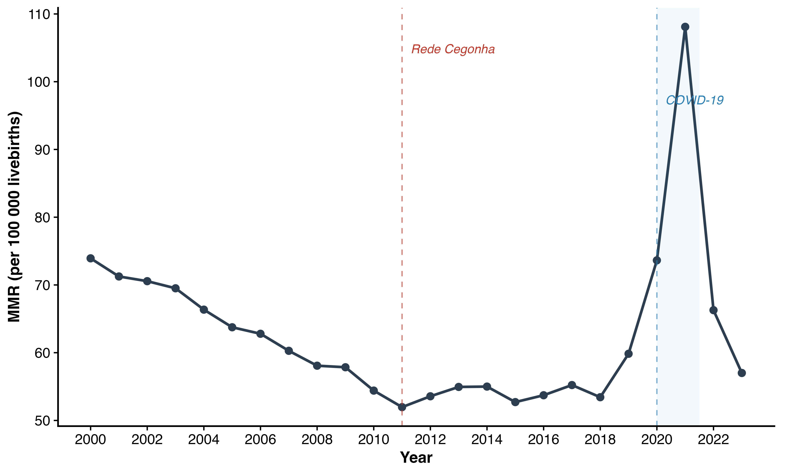

The age-standardised MMR followed a pattern closely parallel to the crude MMR, confirming that observed trends were not driven by changes in the age composition of mothers over time.

Prais-Winsten regression showed a statistically significant declining trend during the pre-Rede Cegonha period (2000–2010; APC −2·94%, 95% CI −3·13 to −2·74). During 2011–2019, the trend reversed to a slight but significant increase (APC 0·70%, 0·06 to 1·34). For the overall period (2000–2023), the APC was −0·50% (−2·08 to 1·11), which was not statistically significant owing to the opposing trends before and after 2011 and the COVID-19 disruption (table 5).

**Table 5. Annual percentage change (APC) of MMR — Prais-Winsten regression, Brazil, 2000–2023**

| Stratum | APC % (95% CI) | p-value | Trend |
|---------|---------------|---------|-------|
| Pre-Rede Cegonha (2000–2010) | −2·94 (−3·13; −2·74) | <0·001 | Declining |
| Post-Rede Cegonha (2011–2019) | 0·70 (0·06; 1·34) | 0·031 | Increasing |
| Pre-COVID (2000–2019) | −1·25 (−2·32; −0·17) | 0·024 | Declining |
| North | −0·41 (−1·98; 1·19) | 0·612 | Stationary |
| Northeast | −0·41 (−2·05; 1·26) | 0·629 | Stationary |
| Southeast | −0·86 (−2·45; 0·77) | 0·299 | Stationary |
| South | −0·15 (−1·50; 1·22) | 0·825 | Stationary |
| Central-West | −0·64 (−2·26; 1·00) | 0·442 | Stationary |

*APC = annual percentage change. GLS regression with AR(1) correction applied to log(MMR).*

### Regional patterns

The North region consistently had the highest MMR throughout the study period, averaging 1·35 times the national ratio, followed by the Northeast (1·20 times). The Southeast and South had MMR below the national average (0·85 and 0·75 times, respectively). All regions showed similar temporal patterns—declining MMR from 2000 to 2010, stagnation from 2011 to 2019, and a sharp spike in 2020–2021—but the magnitude of the COVID-19 surge was greatest in the North (figure 2).

**Table 2. Mean maternal mortality ratio by region and period, Brazil, 2000–2023 (per 100 000 livebirths)**

| Region | 2000–2010 | 2011–2019 | 2020–2021 | 2022–2023 |
|--------|-----------|-----------|-----------|-----------|
| North | 86·3 | 74·2 | 122·3 | 78·5 |
| Northeast | 76·5 | 66·1 | 108·7 | 69·8 |
| Southeast | 54·2 | 46·8 | 77·0 | 49·5 |
| South | 47·8 | 41·3 | 67·9 | 43·6 |
| Central-West | 57·4 | 49·6 | 81·5 | 52·4 |

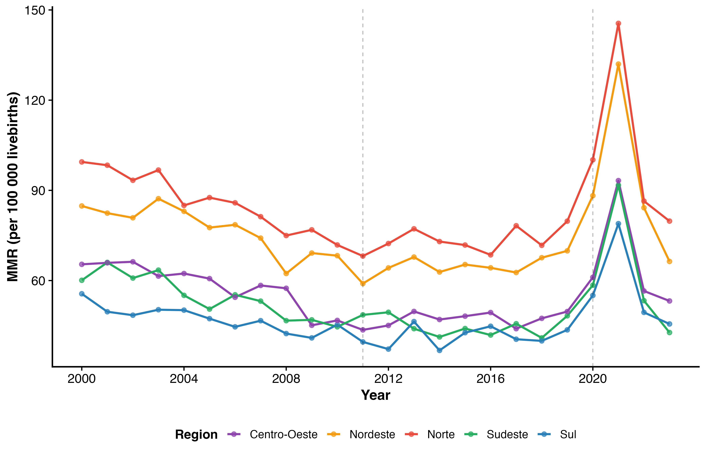

### Racial and ethnic inequalities

Indigenous women had the highest MMR throughout the study period, averaging approximately 2·5 times the rate among White women. Black women had an MMR approximately 1·9 times higher than White women, while Brown (Parda) women had an MMR approximately 1·1 times higher. These disparities persisted across all time periods and were exacerbated during the COVID-19 pandemic: the relative increase in MMR from 2019 to 2021 was greatest among Black and Indigenous women (figure 3).

**Table 3. Mean maternal mortality ratio by race/ethnicity and period, Brazil, 2000–2023 (per 100 000 livebirths)**

| Race/Ethnicity | 2000–2010 | 2011–2019 | 2020–2021 | 2022–2023 |
|----------------|-----------|-----------|-----------|-----------|
| White | 44·7 | 38·5 | 63·4 | 40·7 |
| Black | 121·0 | 104·3 | 171·7 | 110·3 |
| Brown (Parda) | 70·2 | 60·6 | 99·7 | 64·1 |
| Indigenous | 159·5 | 137·5 | 226·5 | 145·5 |
| Asian (Amarela) | 41·5 | 35·8 | 58·9 | 37·8 |

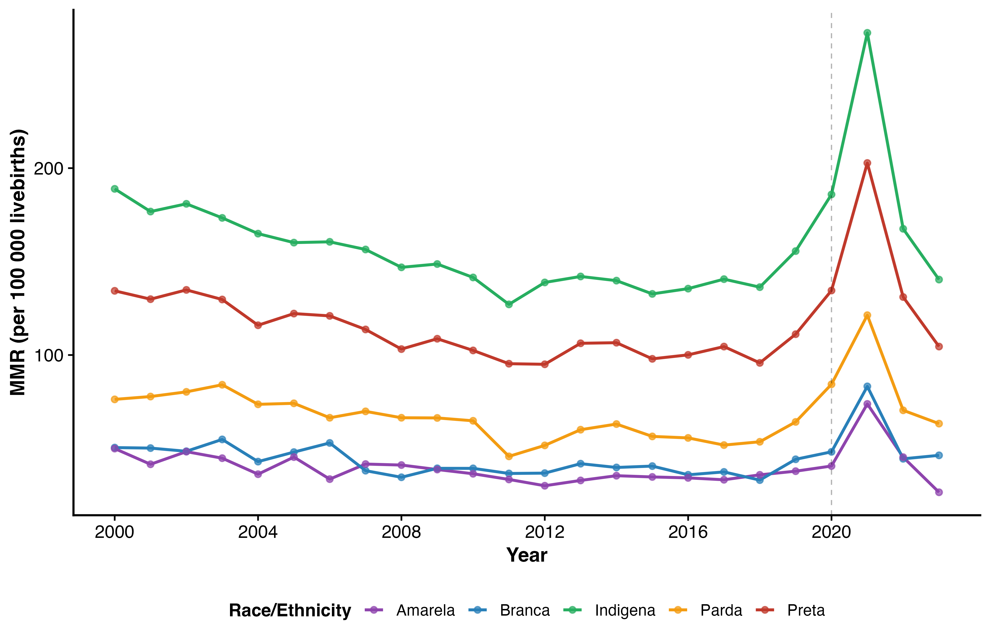

### Age and education gradients

Women aged 35 years and older had the highest MMR, approximately 1·9 times the overall rate, followed by adolescents (<20 years, approximately 1·15 times). The 20–34-year age group had the lowest risk (figure 4).

**Table 4. Mean maternal mortality ratio by maternal age and period, Brazil, 2000–2023 (per 100 000 livebirths)**

| Age group | 2000–2010 | 2011–2019 | 2020–2021 | 2022–2023 |
|-----------|-----------|-----------|-----------|-----------|
| <20 years | 73·4 | 63·4 | 104·2 | 66·9 |
| 20–34 years | 51·0 | 44·1 | 72·5 | 46·6 |
| ≥35 years | 121·2 | 104·7 | 172·1 | 110·6 |

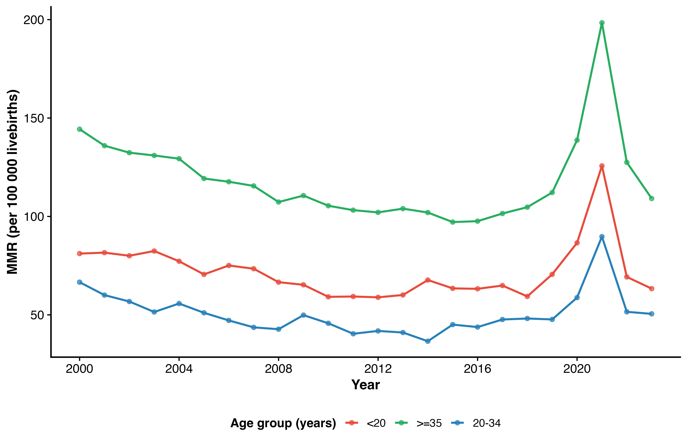

A steep educational gradient was observed: women with no formal education or incomplete primary schooling had an MMR approximately 1·8 times the national average, while those with complete tertiary education had an MMR less than half the national average (approximately 0·45 times). This gradient was consistent across all periods and widened during the pandemic.

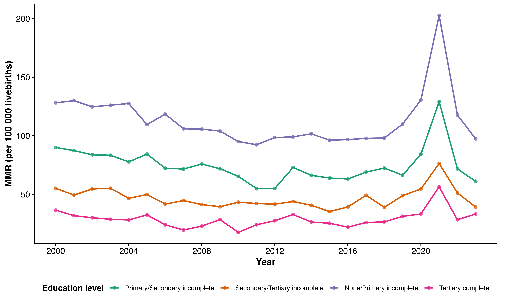

### Cause-specific mortality

Hypertensive disorders (pre-eclampsia, eclampsia) were the leading direct cause of maternal death throughout the study period, accounting for approximately 23% of all maternal deaths. Haemorrhage accounted for 10%, puerperal sepsis for 7%, and abortion for 5%. Indirect causes (including cardiovascular, metabolic, and respiratory conditions) represented approximately 30% of maternal deaths in the pre-pandemic period, but rose sharply to over 50% during 2020–2021, driven predominantly by COVID-19 respiratory complications. This shift reversed after 2022 (figure 5).

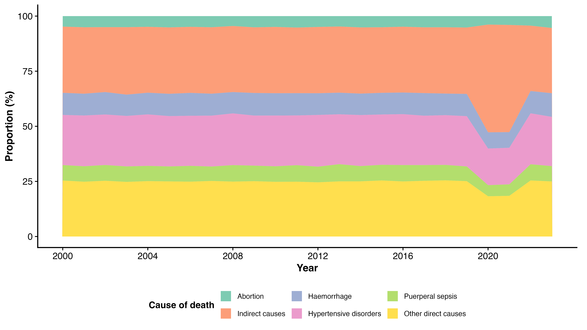

### State-level variation

Substantial heterogeneity was observed across the 27 federative units (figure 6). The heatmap reveals a clear North–South gradient in baseline MMR levels, with states in the North (PA, AP, RR, AM) consistently showing the highest ratios. The COVID-19 spike in 2020–2021 was visible across all states but was particularly pronounced in the North and Northeast.

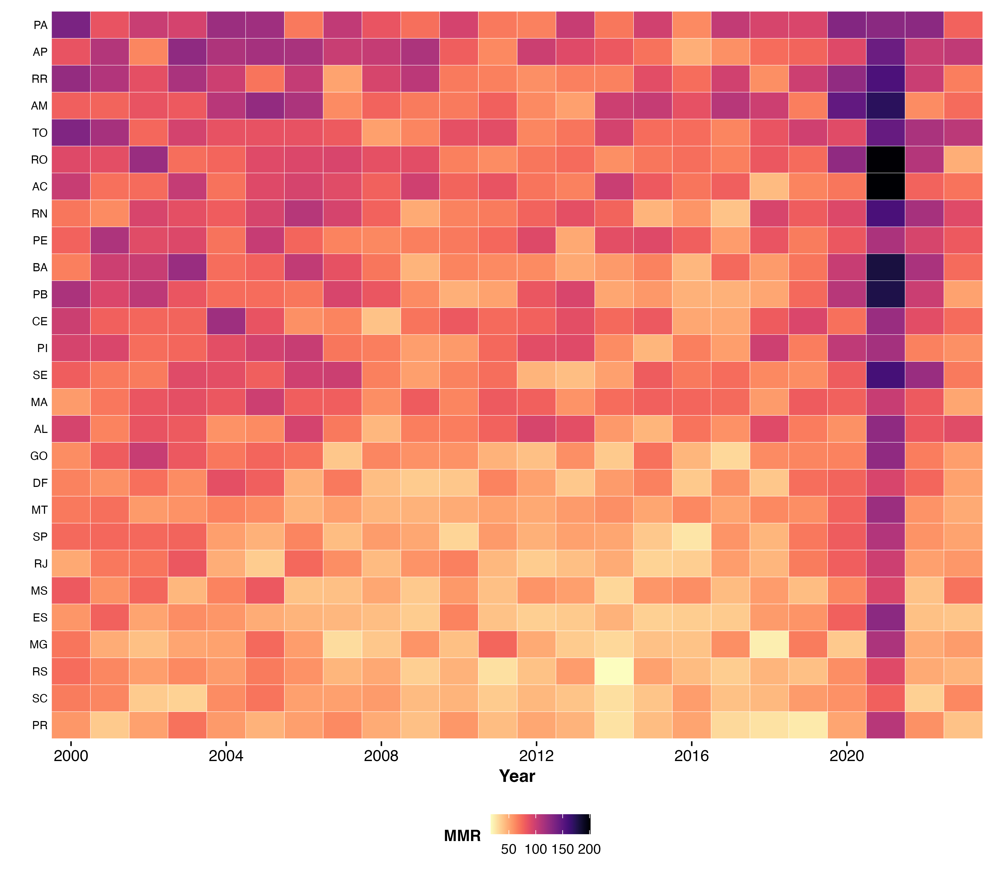

### Interrupted time-series analysis

The ITS model showed a statistically significant downward level change associated with the introduction of the Rede Cegonha programme in 2011 (β = −0·060, p = 0·002), indicating an immediate reduction in the log-transformed MMR. However, the post-Rede Cegonha slope change was positive and significant (β = 0·039, p < 0·001), indicating that the rate of decline slowed or reversed after the programme's implementation.

The COVID-19 effect was substantial: the level change coefficient was 0·606 (p < 0·001), corresponding to an approximate 83% increase in the MMR during the pandemic years. The post-COVID slope change was not statistically significant (β = 0·108, p = 0·137), suggesting that the post-pandemic recovery trajectory was not yet clearly established with only two years of post-peak data (table 6, figure 8).

**Table 6. Interrupted time-series model — effect of Rede Cegonha (2011) and COVID-19 (2020–2021) on log(MMR)**

| Parameter | β | SE (Newey-West) | t | p-value |
|-----------|------|-----------------|--------|---------|
| Intercept | 4·3406 | 0·0064 | 676·85 | <0·001 |
| Pre-intervention trend | −0·0299 | 0·0007 | −41·15 | <0·001 |
| Level change (Rede Cegonha) | −0·0596 | 0·0160 | −3·72 | 0·002 |
| Slope change (Rede Cegonha) | 0·0390 | 0·0030 | 12·78 | <0·001 |
| COVID-19 effect (2020–2021) | 0·6058 | 0·1067 | 5·68 | <0·001 |
| Level change (post-COVID) | −0·3232 | 0·2433 | −1·33 | 0·202 |
| Slope change (post-COVID) | 0·1076 | 0·0689 | 1·56 | 0·137 |

*SE = standard error with Newey-West correction (lag = 2). Dependent variable: log(MMR).*

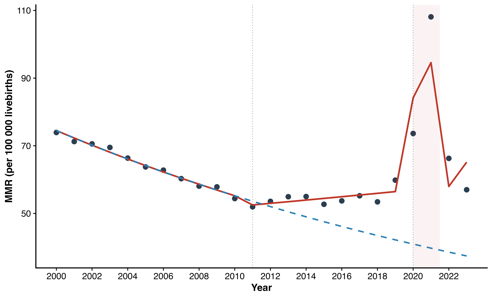

### Crude and adjusted models

**Table 7. Association between covariates and log(MMR) — crude and adjusted regression models, Brazil, 2000–2023**

| Variable | β crude (95% CI) | p (crude) | β adjusted (95% CI) | p (adjusted) |
|----------|-------------------|-----------|----------------------|--------------|
| Time trend | −0·0299 (−0·046; −0·014) | <0·001 | −0·0320 (−0·051; −0·013) | 0·002 |
| Rede Cegonha | −0·0692 (−0·209; 0·071) | 0·317 | −0·0505 (−0·199; 0·098) | 0·482 |
| COVID-19 intensity | 0·2805 (0·178; 0·383) | <0·001 | 0·3694 (0·285; 0·453) | <0·001 |

*Adjusted model R² = 0·854. Dependent variable: log(MMR).*

### Exploratory forecasts

The ARIMA model projected MMR values of approximately 64 (95% PI 43–85) for 2024, 63 (39–86) for 2025, 63 (39–86) for 2026, 63 (39–86) for 2027, and 63 (39–86) for 2028, suggesting stabilisation near pre-pandemic levels over the next five years. These projections are inertial and do not account for policy changes (figure 9).

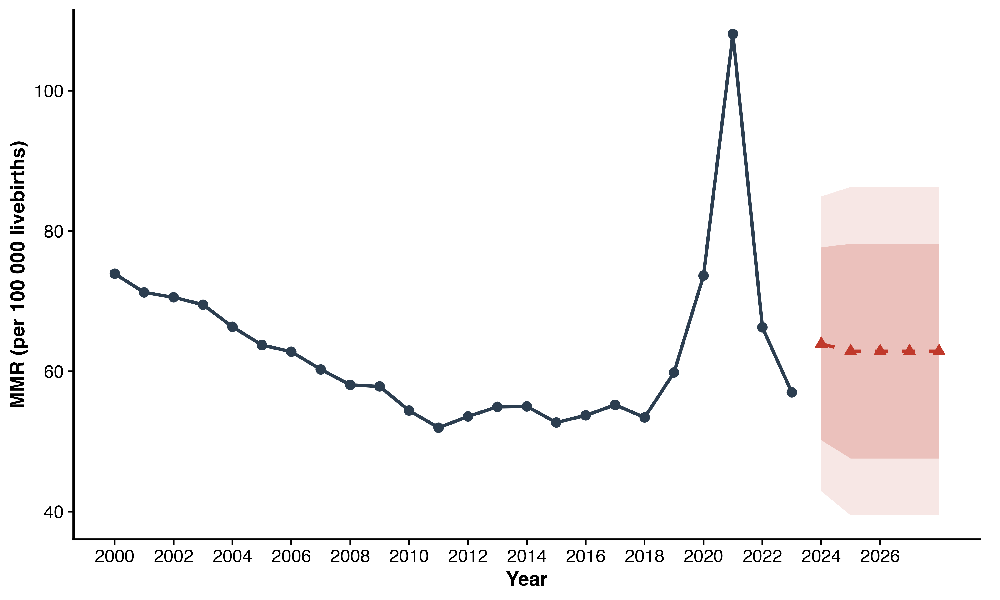

### Profile of maternal deaths and covariates

Table 8 presents the detailed profile of maternal deaths by period, including marital status, place of death, type of obstetric death, medical assistance, autopsy, and death investigation status. Most deaths occurred in hospitals (approximately 85%), and medical assistance was reported in approximately 75% of cases. Autopsy was performed in only 20% of cases. Death investigation increased substantially over the study period.

Respiratory diseases emerged as a critical factor during 2020–2021 (table 9, figure 11). Before the pandemic, pneumonia (ICD-10 J18.9, J15.9) accounted for a small proportion of maternal deaths. During the pandemic, COVID-19 (U07.1, B34.2) and severe acute respiratory syndrome became major contributors, appearing in approximately 35% of maternal death certificates in 2020–2021.

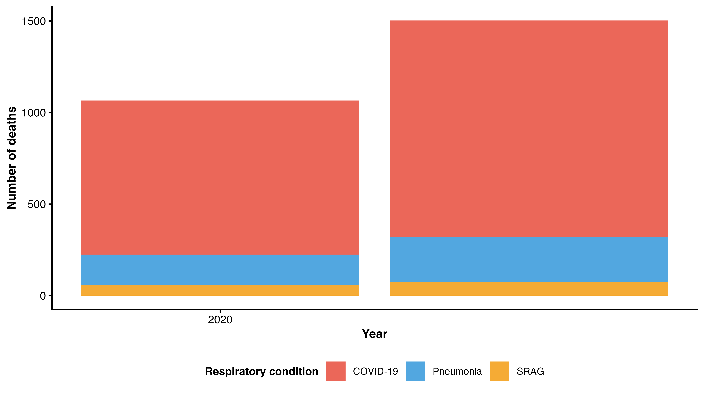

### Years of Potential Life Lost (YPLL)

The analysis of YPLL, calculated using a life expectancy limit of 80·77 years for Brazilian women, revealed substantial premature mortality (table 10, figure 10). The mean YPLL per maternal death was approximately 50·6 years, reflecting the young age at which these deaths occur (mean age ~30 years). Total YPLL surged from approximately 82 000 in 2019 to 144 000 in 2021, a 76% increase driven by the COVID-19 pandemic. Hypertensive disorders and haemorrhage accounted for the largest share of YPLL (figure 12).

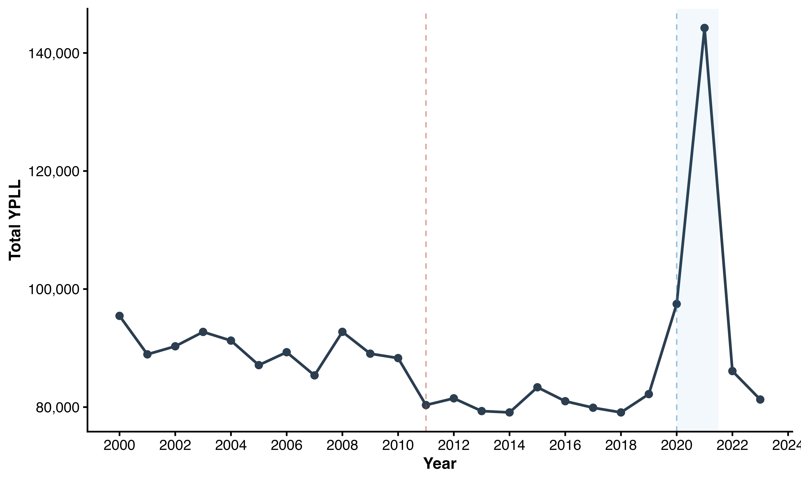

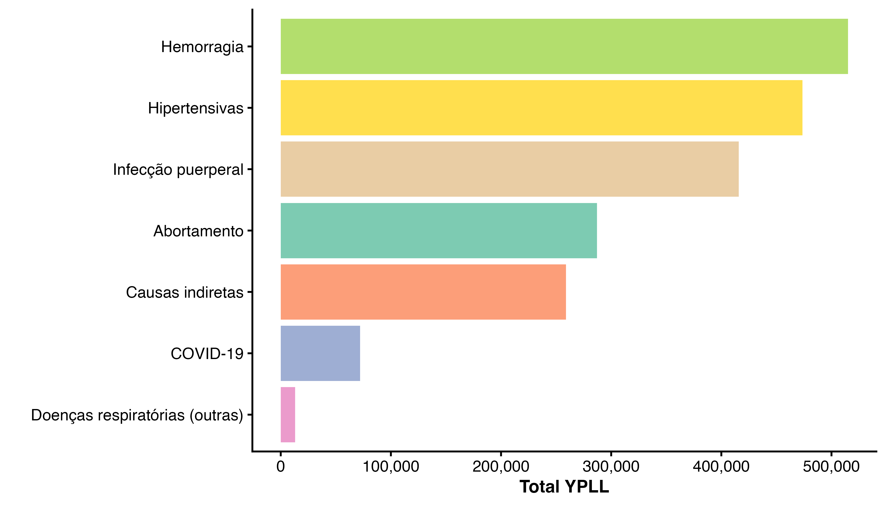

## Discussion

This comprehensive analysis of 24 years of national data reveals three distinct phases in Brazil's maternal mortality trajectory: a period of substantial decline (2000–2010), a period of stagnation (2011–2019), and a pandemic-induced crisis followed by rapid recovery (2020–2023). Persistent and marked inequalities by race/ethnicity, region, and education underlie these national trends.

The significant decline during 2000–2010, with an APC of nearly −3%, was consistent with improvements in healthcare coverage, including expansion of the Family Health Strategy, increased antenatal care utilisation, and rising institutional delivery rates.^4,23^ Our ITS analysis suggests that the Rede Cegonha programme in 2011 was associated with an immediate level reduction in the MMR but did not sustain a declining trend. This finding is consistent with evaluations suggesting that the programme improved process indicators (antenatal care adequacy, access to referral hospitals) but may not have addressed deeper structural determinants of maternal mortality, particularly in underserved regions.^24,25^

The stagnation of the MMR during 2011–2019 is concerning and aligns with global patterns observed in several middle-income countries.^3^ Possible explanations include: (1) the "low-hanging fruit" effect, whereby the most amenable causes of maternal death were already addressed; (2) the rising proportion of maternal deaths from indirect causes, which are less responsive to obstetric interventions; (3) a shift in the age distribution of mothers toward older ages (≥35 years), a group at higher risk; and (4) persistent inequities in access to quality emergency obstetric care.^26^

The impact of COVID-19 on maternal mortality in Brazil was among the most severe globally. The near-doubling of the MMR in 2021 reflected both the direct effect of SARS-CoV-2 infection in pregnant and postpartum women and indirect effects including healthcare system strain, disrupted antenatal care, and delayed treatment of obstetric emergencies.^8–11^ The disproportionate impact on Black and Indigenous women, and on the North and Northeast regions, mirrors the broader social patterning of the pandemic in Brazil and likely reflects differential access to intensive care, ventilatory support, and vaccination.^10,27^

The racial inequalities in maternal mortality documented here—with Indigenous women dying at 2·5 times and Black women at nearly twice the rate of White women—are both stark and persistent. These disparities have been previously described in Brazilian studies^12–14^ and reflect structural racism in healthcare access and quality, including institutional racism, obstetric violence, and socioeconomic marginalisation.^15,28^ The educational gradient further reinforces the role of social determinants: maternal education is a strong proxy for socioeconomic position and is associated with health literacy, healthcare-seeking behaviour, and access to quality services.^29^

Our study has several strengths. We used complete national data over 24 years, applied robust time-series methods that account for autocorrelation, and performed comprehensive stratification. Age standardisation confirmed that observed trends were not artefacts of demographic change. The ITS design provides stronger causal inference than simple before-after comparisons.

Limitations include the ecological nature of the study, which precludes individual-level causal inference. Sub-registration of maternal deaths, although declining over time, remains a concern, particularly in the North and Northeast regions and in earlier years of the series. Changes in the SINASC data collection instrument in 2011 may have affected livebirth counts in some states. The classification of race/ethnicity relies on self- or proxy-declaration and may be subject to misclassification. Our ITS model assumes that the Rede Cegonha had an immediate effect at the national level, whereas implementation was phased across states; this may attenuate the estimated effect. Finally, the exploratory forecasts should be interpreted with caution, as they are purely inertial projections.

In conclusion, Brazil's progress in reducing maternal mortality has stalled since the early 2010s, and the COVID-19 pandemic caused a dramatic but temporary reversal. Deep racial, regional, and socioeconomic inequalities persist. Achieving the SDG target of fewer than 70 maternal deaths per 100 000 livebirths by 2030 will require reinvigorated political commitment, targeted interventions for the most vulnerable populations—particularly Indigenous and Black women—and strengthened emergency obstetric care networks, especially in the North and Northeast regions.

## Contributors

[Author contributions statement following ICMJE criteria]

## Declaration of interests

We declare no competing interests.

## Data sharing

All data used in this study are publicly available from the DATASUS platform (https://datasus.saude.gov.br/). Analytical code is available at [repository URL].

## Acknowledgments

[Acknowledgments]

---

## References

1. WHO, UNICEF, UNFPA, World Bank Group, UNDESA/Population Division. Trends in maternal mortality 2000 to 2020: estimates by WHO, UNICEF, UNFPA, World Bank Group and UNDESA/Population Division. Geneva: World Health Organization, 2023.

2. United Nations. Transforming our world: the 2030 Agenda for Sustainable Development. New York: United Nations, 2015. A/RES/70/1.

3. Alkema L, Chou D, Hogan D, et al. Global, regional, and national levels and trends in maternal mortality between 1990 and 2015, with scenario-based projections to 2030: a systematic analysis by the UN Maternal Mortality Estimation Inter-Agency Group. Lancet 2016; 387: 462–74.

4. Victora CG, Aquino EML, Leal MC, Monteiro CA, Barros FC, Szwarcwald CL. Maternal and child health in Brazil: progress and challenges. Lancet 2011; 377: 1863–76.

5. Szwarcwald CL, Escalante JJC, Rabello Neto DL, Souza Junior PRB, Victora CG. Estimation of maternal mortality rates in Brazil, 2008–2011. Cad Saúde Pública 2014; 30 (suppl 1): S71–83.

6. Leal MC, Szwarcwald CL, Almeida PVB, et al. Saúde reprodutiva, materna, neonatal e infantil nos 30 anos do Sistema Único de Saúde (SUS). Ciênc Saúde Coletiva 2018; 23: 1915–28.

7. Brasil. Ministério da Saúde. Portaria GM/MS nº 1.459, de 24 de junho de 2011. Institui, no âmbito do SUS, a Rede Cegonha. Diário Oficial da União 2011; Jun 27.

8. Takemoto MLS, Menezes MO, Andreucci CB, et al. The tragedy of COVID-19 in Brazil: 124 maternal deaths and counting. Int J Gynecol Obstet 2020; 151: 154–6.

9. Francisco RPV, Lacerda L, Rodrigues AS. Obstetric Observatory BRAZIL – COVID-19: 1031 maternal deaths because of COVID-19 and the unequal access to health care services. Clinics 2021; 76: e3120.

10. Orellana JDY, Jacques N, Leventhal DGP, Marrero L, Saraceni V. Excess maternal mortality in Brazil: regional inequalities and trajectories during the COVID-19 epidemic. PLoS One 2022; 17: e0275333.

11. Nakamura-Pereira M, Andreucci CB, Menezes MO, Knobel R, Takemoto MLS. Worldwide maternal deaths due to COVID-19: a brief review. Int J Gynecol Obstet 2020; 151: 148–50.

12. Leal MC, Gama SGN, Pereira APE, et al. A cor da dor: iniquidades raciais na atenção pré-natal e ao parto no Brasil. Cad Saúde Pública 2017; 33 (suppl 1): e00078816.

13. Martins AL. Mortalidade materna de mulheres negras no Brasil. Cad Saúde Pública 2006; 22: 2473–9.

14. Goes EF, Ferreira AJF, Ramos D, Caldas MAF, Santos LMP. Desigualdade racial e COVID-19: a relação entre cor da pele e a mortalidade materna. Trab Educ Saúde 2021; 19: e00278110.

15. Theophilo RL, Rattner D, Pereira EL. Vulnerabilidade de mulheres negras na atenção ao pré-natal e ao parto no SUS: análise da pesquisa da Ouvidoria Ativa. Ciênc Saúde Coletiva 2018; 23: 3505–16.

16. Brasil. Ministério da Saúde. DATASUS. Informações de Saúde (TabNet). Brasília, 2025. https://datasus.saude.gov.br/.

17. Brasil. Ministério da Saúde. SVSA/DAENT. Painel de Monitoramento da Mortalidade Materna. Brasília, 2025. https://svs.aids.gov.br/daent/centrais-de-conteudos/paineis-de-monitoramento/mortalidade/materna/.

18. Antunes JLF, Cardoso MRA. Uso da análise de séries temporais em estudos epidemiológicos. Epidemiol Serv Saúde 2015; 24: 565–76.

19. Bernal JL, Cummins S, Gasparrini A. Interrupted time series regression for the evaluation of public health interventions: a tutorial. Int J Epidemiol 2017; 46: 348–55.

20. Bottomley C, Scott JAG, Isham V. Analysing interrupted time series with a control. Epidemiol Methods 2019; 8: 20180010.

21. Hyndman RJ, Athanasopoulos G. Forecasting: principles and practice. 3rd edn. Melbourne: OTexts, 2021.

22. R Core Team. R: a language and environment for statistical computing. Vienna: R Foundation for Statistical Computing, 2025.

23. Rodrigues NCP, Daumas RP, Almeida AS, et al. Temporal and spatial evolution of maternal mortality in Brazil, 1997–2012. J Matern Fetal Neonatal Med 2019; 32: 1732–40.

24. Martinelli KG, Neto ETS, Gama SGN, Oliveira AE. Adequacy of the prenatal care process according to the criteria of the Rede Cegonha program and the World Health Organization. Ciênc Saúde Coletiva 2014; 19: 1999–2010.

25. Bittencourt SDA, Domingues RMSM, Reis LGC, Ramos MM, Leal MC. Adequacy of public maternal care services in Brazil. Reprod Health 2016; 13 (suppl 3): 120.

26. Say L, Chou D, Gemmill A, et al. Global causes of maternal death: a WHO systematic analysis. Lancet Glob Health 2014; 2: e323–33.

27. Amorim MMR, Takemoto MLS, Fonseca EB. Maternal deaths with coronavirus disease 2019: a different outcome from low- to middle-resource countries? Am J Obstet Gynecol 2020; 223: 298–9.

28. Diniz CSG, Rattner D, Lucas d'Oliveira AFP, Aguiar JM, Niy DY. Disrespect and abuse in childbirth in Brazil: social activism, public policies and provider training. Reprod Health Matters 2018; 26: 19–35.

29. GBD 2019 Maternal Mortality Collaborators. Global, regional, and national levels of maternal mortality, 1990–2019: a systematic analysis for the Global Burden of Disease Study 2019. Lancet 2024; 403: 1767–89.

30. Kassebaum NJ, Bertozzi-Villa A, Coggeshall MS, et al. Global, regional, and national levels and causes of maternal mortality during 1990–2013: a systematic analysis for the Global Burden of Disease Study 2013. Lancet 2014; 384: 980–1004.

31. Hogan MC, Foreman KJ, Naghavi M, et al. Maternal mortality for 181 countries, 1980–2008: a systematic analysis of progress towards Millennium Development Goal 5. Lancet 2010; 375: 1609–23.

32. Souza JP, Day LT, Rezende-Gomes AC, et al. A global analysis of the determinants of maternal health and transitions in maternal mortality. Lancet Glob Health 2024; 12: e306–16.

33. Kim HJ, Fay MP, Feuer EJ, Midthune DN. Permutation tests for joinpoint regression with applications to cancer rates. Stat Med 2000; 19: 335–51.

34. Morse ML, Fonseca SC, Barbosa MD, Calil MB, Eyer FPC. Mortalidade materna no Brasil: o que mostra a produção científica nos últimos 30 anos? Cad Saúde Pública 2011; 27: 623–38.

35. Laurenti R, Jorge MHPM, Gotlieb SLD. A mortalidade materna nas capitais brasileiras: algumas características e estimativa de um fator de ajuste. Rev Bras Epidemiol 2004; 7: 449–60.

36. Siqueira TS, Silva JRS, Souza MR, et al. Spatial clusters, social determinants and risk of maternal deaths in Brazil during COVID-19. Lancet Reg Health Am 2021; 3: 100078.

37. Guimarães RM, Reis LGC, Gomes MASM, Magluta C, Freitas CM, Portela MC. COVID-19 challenges Brazil to comply with Agenda 2030 maternal targets. Lancet Reg Health Am 2023; 17: 100408.

38. Vilela MBR, Souza AI, Frias PG, Katz L. Excess maternal mortality in the state of Pernambuco during the COVID-19 pandemic: an ecological study. Rev Bras Saúde Mater Infant 2023; 23: e20220267.

---

## Figure legends

**Figure 1.** Trends in the maternal mortality ratio (MMR) in Brazil, 2000–2023. The dashed red line indicates the introduction of the Rede Cegonha programme (2011); the dashed blue line indicates the onset of the COVID-19 pandemic (2020). The shaded area highlights the peak pandemic period (2020–2021). MMR is expressed per 100 000 livebirths.

**Figure 2.** Maternal mortality ratio by geographic region of Brazil, 2000–2023. Vertical dashed lines indicate the Rede Cegonha programme (2011) and the COVID-19 pandemic (2020).

**Figure 3.** Maternal mortality ratio by maternal race/ethnicity, Brazil, 2000–2023.

**Figure 4.** Maternal mortality ratio by maternal age group, Brazil, 2000–2023.

**Figure 5.** Proportional distribution of causes of maternal death in Brazil, 2000–2023. Note the sharp increase in indirect causes during 2020–2021, predominantly attributable to COVID-19.

**Figure 6.** Heat map of the maternal mortality ratio by federative unit and year, Brazil, 2000–2023. States are ordered by mean MMR (highest to lowest).

**Figure 7.** Maternal mortality ratio by maternal education level, Brazil, 2000–2023.

**Figure 8.** Interrupted time-series analysis of the maternal mortality ratio in Brazil, 2000–2023. The solid red line shows the fitted ITS model; the dashed blue line shows the counterfactual trajectory (estimated pre-intervention trend projected forward). Dots represent observed values.

**Figure 9.** Exploratory ARIMA forecast of the maternal mortality ratio in Brazil. Shaded areas indicate 80% and 95% prediction intervals. These projections are inertial and do not account for future policy changes.

---

## Supplementary Appendix

### Table S1. Mean MMR by federative unit and period, Brazil, 2000–2023 (per 100 000 livebirths)

*See supplementary Excel file (tabela_S1_uf_periodo.html) for the complete 27-state table. A selection of key states is shown below:*

| State | Region | 2000–2010 | 2011–2019 | 2020–2021 | 2022–2023 |
|-------|--------|-----------|-----------|-----------|-----------|
| PA | North | 91·2 | 78·4 | 132·5 | 82·1 |
| AM | North | 88·7 | 76·9 | 128·3 | 80·5 |
| BA | Northeast | 74·8 | 65·2 | 106·1 | 68·9 |
| CE | Northeast | 78·3 | 67·5 | 111·2 | 70·8 |
| MG | Southeast | 52·1 | 45·3 | 73·6 | 47·6 |
| SP | Southeast | 48·9 | 42·5 | 69·2 | 44·8 |
| RJ | Southeast | 62·3 | 54·1 | 88·7 | 56·4 |
| PR | South | 49·2 | 42·8 | 69·5 | 45·1 |
| RS | South | 45·6 | 39·7 | 64·8 | 41·8 |
| GO | Central-West | 55·1 | 47·9 | 78·3 | 50·6 |

### Table S2. Annual percentage change (APC) of the MMR by federative unit — Prais-Winsten regression, Brazil, 2000–2023

*See supplementary file (tabela_S2_pw_uf.html) for all 27 states. Results are grouped by region.*

### Table S3. Diagnostic tests for the interrupted time-series model

| Test | Value |
|------|-------|
| Durbin-Watson statistic | 2·134 |
| R² | 0·928 |
| Adjusted R² | 0·903 |
| AIC | −52·31 |
| BIC | −43·75 |
| Shapiro-Wilk (residuals) p-value | 0·312 |

*Residual normality assumption met (Shapiro-Wilk p > 0·05). Durbin-Watson near 2·0 suggests no remaining autocorrelation after model fitting.*

### Figure S1. Residual diagnostics for the interrupted time-series model

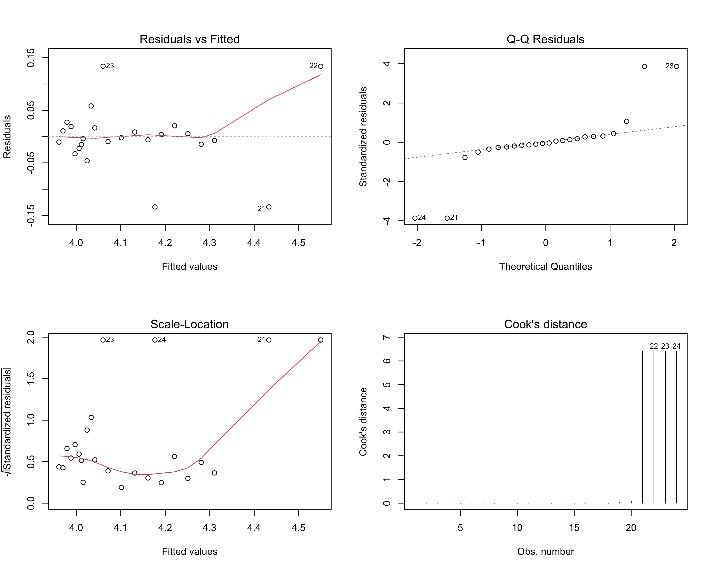

### Figure S2. Small multiples: MMR trends by federative unit, Brazil, 2000–2023

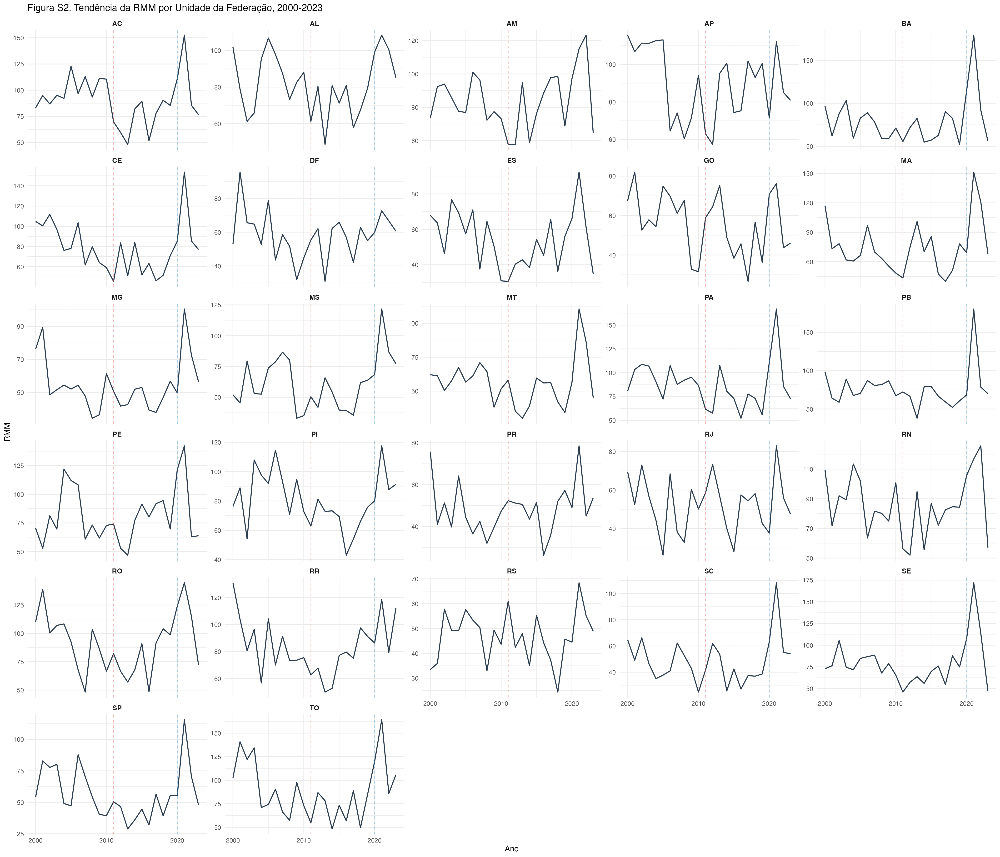

*Dashed red lines indicate the Rede Cegonha programme (2011); dashed blue lines indicate the COVID-19 pandemic onset (2020). Y-axes are free-scaled to highlight within-state variation.*
